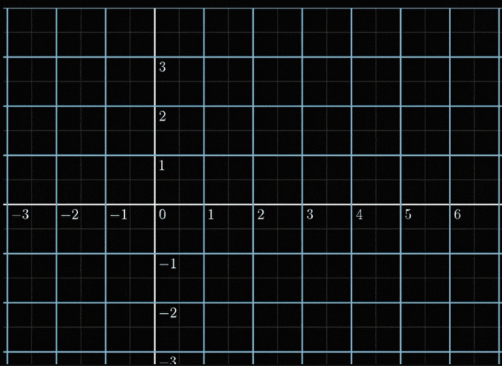
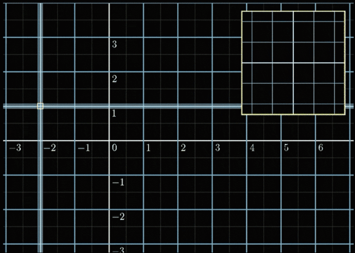

## Normalizing flow

Before we actually get into the normalizing flow, we need to discuss some concept of Jacobian.


### Jacobian matrix

Consider a simple transition:
f([x,y]) = [x+sin(y), y+sin(x)]




We can see that this transition is quite complex and difficult to discuss. 

But this transition has an important property: Local linearly.



It is clear to see that local transition is linearly transform. Thus, we can use this property.
```markdown
 
Syntax highlighted code block

# Header 1
## Header 2
### Header 3

- Bulleted
- List

1. Numbered
2. List

**Bold** and _Italic_ and `Code` text

[Link](url) and 
```

For more details see [GitHub Flavored Markdown](https://guides.github.com/features/mastering-markdown/).

### Jekyll Themes

Your Pages site will use the layout and styles from the Jekyll theme you have selected in your [repository settings](https://github.com/QingheGao/thesis.io/settings). The name of this theme is saved in the Jekyll `_config.yml` configuration file.

### Support or Contact

Having trouble with Pages? Check out our [documentation](https://docs.github.com/categories/github-pages-basics/) or [contact support](https://github.com/contact) and we’ll help you sort it out.
