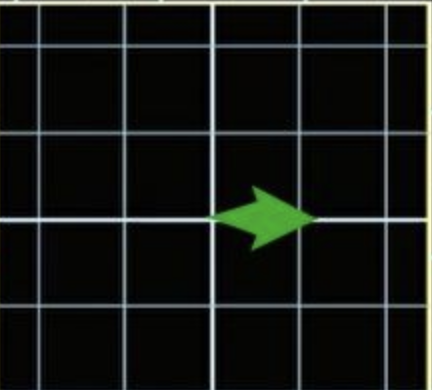

## Normalizing flow

Before we actually get into the normalizing flow, we need to discuss some concept of Jacobian.

### Jacobian matrix

Consider a simple transition:
f([x,y]) = [x+sin(y), y+sin(x)]

We can see that this transition is quite complex and difficult to discuss. 

But this transition has an important property: Local linearly.

It is clear to see that local transition is linearly transform. Thus, we can use this property.

Linearly transform of x and y means the coordinates after linear transformation are actually parallel to each other.

First, consider a small distance dx as green arrow shows.

https://zhuanlan.zhihu.com/p/100287713
